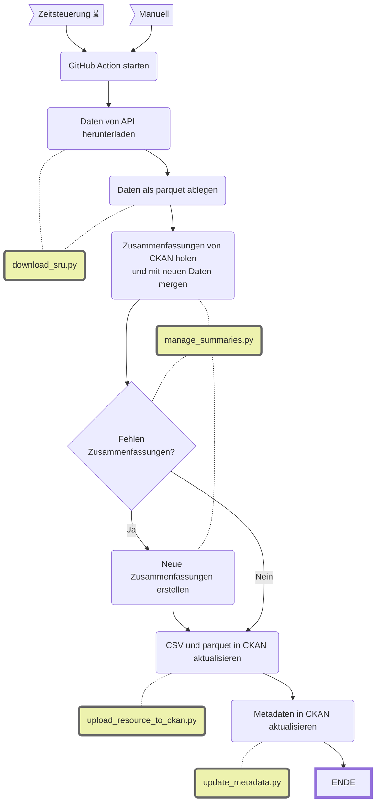
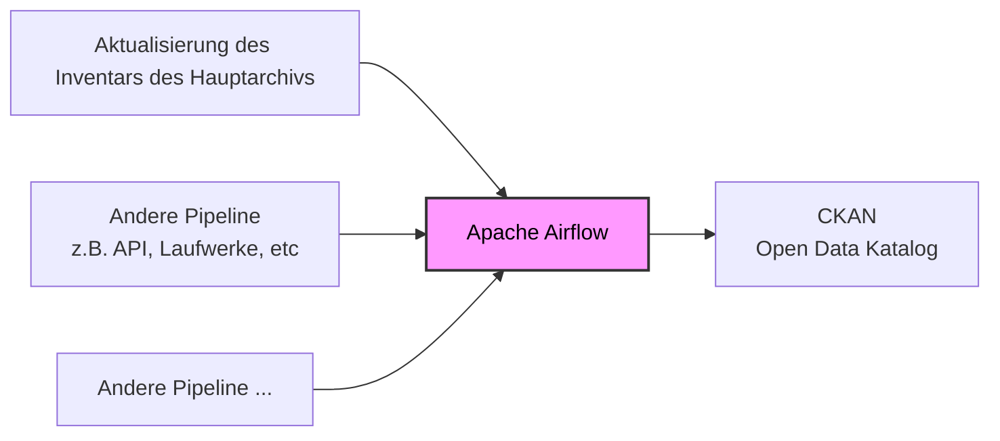

# CAS Data Engineering Airflow
Dieses Repository enthält einen Proof of Concept für Datenaktualisierungspipelines mit Apache Airflow auf Basis von Open Data Zürich. Das Projekt wurde erstellt als Prüfungsleistung im Rahmen des [CAS Data Engineering der FHNW](https://www.fhnw.ch/de/weiterbildung/informatik/cas-data-engineering). Die Bewertung erfolgt durch [Tobias Kaymak](https://github.com/tkaymak).

# Lokales Testen
Dieses Projekt verwendet die Astronomer-Distribution von Apache Airflow. Um das Setup lokal auszuführen, wird das `astro` CLI benötigt. Die Installationsanleitung findet sich [hier](https://www.astronomer.io/docs/astro/cli/install-cli).
**Schritte zur lokalen Ausführung:**
1. Dieses Repository in ein lokales Verzeichnis klonen und dieses im Terminal öffnen.
2. Das Astronomer-Projekt initialisieren: `astro dev init`. Da bereits Dateien im Ordner vorhanden sind, erscheint eine Rückfrage – diese mit `y` bestätigen.
3. Das Projekt starten: `astro dev start`
4. Die benötigten Container werden automatisch heruntergeladen und gestartet. Sobald Airflow bereit ist, öffnet sich die Weboberfläche im Browser. Alternativ kann sie direkt über folgende Adresse aufgerufen werden: [http://localhost:8080/](http://localhost:8080/).
5. Zum Beenden der lokalen Umgebung: `astro dev stop`

**Secrets:**
Damit der DAG vollständig durchlaufen kann, sind verschiedene Zugangsdaten erforderlich. Diese sollten in einer `.env`-Datei im Projektordner abgelegt werden. Benötigte Umgebungsvariablen:
```
CKAN_BASE_URL_INT=https://ckan-staging.zurich.datopian.com/
CKAN_API_KEY_INT=...
GOOGLE_API=...
```
- Die CKAN Variablen werden benötigt, um den Datensatz auf den Open Data Katalog der Stadt Zürich zu laden. 
- Der Google-API Key wird für die Generierung einer Dokumentenzusammenfassung über [Gemini](https://gemini.google.com) benötigt. Ein API Key kann hier erstellt werden: https://aistudio.google.com/api-keys


# Ist-Zustand

## Datenaktualisierungen bei Open Data Zürich

Alle Open Government Data der Stadt Zürich werden über den Open-Data-Katalog unter https://data.stadt-zuerich.ch/ veröffentlicht. Die Datenlieferungen erreichen den Katalog in unterschiedlichen Formen und Dateiformaten, und die jeweiligen Data Owner verfügen über sehr unterschiedliche technische Möglichkeiten zur Bereitstellung der Daten. Um diesen heterogenen Voraussetzungen gerecht zu werden, existieren mehrere Wege, wie Datensätze auf dem Katalog publiziert und aktualisiert werden:

- **Dropzone:**  Dies ist ein geteilter Ordner, in dem Datenlieferanten Rohdaten und dazugehörige Metadaten ablegen können. Die Zugriffsrechte ermöglichen es ihnen, Dateien direkt in den jeweiligen Unterordnern in beliebiger Frequenz zu aktualisieren. Diese Unterordner werden vom Datenkatalog via WebDAV „geharvestet“. Das bedeutet, dass der Katalog die Daten in regelmässigen Intervallen abholt und automatisch importiert. Der Grossteil der Datensätze wird aktuell über diesen Weg gepflegt. Admin-Benutzer können die einzelnen Harvester im Webinterface des Datenkatalogs überwachen sowie starten oder stoppen.

- **GitHub Actions:** Einige Datensätze werden mithilfe automatisierter Workflows über GitHub Actions aktualisiert. Die entsprechenden Workflows befinden sich in diesem [Repository](https://github.com/opendatazurich/opendatazurich.github.io), der tatsächlich auszuführende Code liegt im Ordner [automation](https://github.com/opendatazurich/opendatazurich.github.io/tree/master/automation). Über diesen Mechanismus werden vor allem Datensätze aktualisiert, die von externen Dienstleistern als API bereitgestellt werden und sehr häufige Updates benötigen (z. B. alle 15 Minuten).

- **GitLab Pipelines:** Ähnlich wie bei GitHub Actions existiert auch ein GitLab-Repository auf der nicht öffentlichen Container-Management-Plattform der Stadt Zürich. Hier werden GitLab-Pipelines zur Aktualisierung von Datensätzen genutzt. Dies betrifft vor allem Daten, die von internen Stellen stammen und vor der Veröffentlichung aufbereitet werden müssen, damit sie den Standards des Open-Data-Katalogs entsprechen.

- **Manueller Upload:** Über die Katalogsoftware [CKAN](https://ckan.org/) können Datensätze auch direkt über das Webinterface aktualisiert werden. Diese Variante wird jedoch nur in Ausnahmefällen verwendet.

Für alle genannten Varianten werden sowohl ein Datensatz (bzw. ein Link zu einen Datensatz) als auch ein zugehöriger Metadatensatz benötigt.  
- **Der Datensatz** enthält die eigentlichen Daten, etwa tabellarische Informationen oder Geodaten.  
- **Der Metadatensatz** enthält allgemeine Informationen zu den Daten und ihrer Interpretation. Er beschreibt den Ursprung des Datensatzes sowie die enthaltenen Attribute.

Daten und Metadaten müssen spezifische Anforderungen erfüllen, die im **Reglement über offene Verwaltungsdaten** unter https://www.stadt-zuerich.ch/opendata festgelegt sind. Für dieses Projekt ist besonders relevant, dass für jede Aktualisierung stets **Daten und Metadaten gemeinsam** benötigt werden.

## Beispiel: Inventar des Hauptarchivs des Stadtarchivs Zürich

Als Beispiel dient hier der Prozess zur Erstellung des [Inventars des Hauptarchivs des Stadtarchivs Zürich](https://data.stadt-zuerich.ch/dataset/sar_inventar_hauptarchiv). Dieser Prozess wurde gewählt, weil er einerseits einen typischen Ablauf eines Aktualisierungsprozesses abbildet: Daten werden über eine Schnittstelle abgefragt und anschliessend als Tabelle im Open-Data-Katalog veröffentlicht. Andererseits ist er etwas komplexer als viele andere Aktualisierungen und eignet sich daher gut als Vorlage für weitere Pipelines.

Die erhöhte Komplexität ergibt sich vor allem daraus, dass unter bestimmten Bedingungen zusätzliche PDF-Dateien heruntergeladen und zusammengefasst werden müssen. Ausserdem werden die Daten nicht nur als CSV, sondern zusätzlich als Parquet-Datei erzeugt. Damit umfasst dieser Prozess mehrere Schritte, die in ähnlicher Form auch bei anderen Datensätzen vorkommen, jedoch meist in reduzierter Form. Dadurch eignet sich dieser Ablauf gut als generisches Muster für zukünftige Aktualisierungsprozesse.

Aktuell wird dieser Prozess noch über die interne GitLab-Instanz der Stadt Zürich ausgeführt und orchestriert.

Die Daten werden vom Stadtarchiv über die eigene [SRU-Schnittstelle](https://amsquery.stadt-zuerich.ch/sru/) des Archivkatalogs bereitgestellt.

Das Skript `download_sru.py` lädt das aktuelle Inventar herunter und speichert das Ergebnis als parquet. Das Skript `manage_summaries.py` lädt den bisherigen Stand vom OGD Katalog herunter. Davon werden die bestehenden Zusammenfassungen übernommen und an das neue Inventar gejoined. Sollte es Downloadlinks geben, für die noch keine Zusammenfassung vorhanden ist, versucht das Skript diese Zusammenfassungen von einem AI Modell erstellen zu lassen.

Es gibt in `summarize_text.py` verschiedene APIs zur Auswahl (z.B. von Hugging Face, OpenAI oder Google). Im Moment wird die Google API verwendet, weil sie kostenlos ist und das Kontextfenster deutlich grösser ist, als bei den anderen (einige der Dokumente sind sehr gross).




## Probleme / Verbesserungspotential

Die aktuell verwendeten Prozesse zur Datenaktualisierung sind historisch gewachsen und weisen mehrere Herausforderungen auf. Zum einen existieren verschiedene Aufbereitungs- und Aktualisierungsprozesse, die jeweils eigene technische Abläufe besitzen. Dadurch fehlt ein einheitliches Monitoring, und es werden nicht überall automatische Benachrichtigungen ausgelöst, wenn Fehler auftreten. Probleme werden daher manchmal erst spät erkannt.

Zudem unterscheiden sich die Verfahren zur Verarbeitung der Metadaten je nach Aktualisierungskanal. Harvester und Aktualisierungen über die CKAN API interpretieren dieselben Metadaten-Inputs leicht anders, sodass die Inputfiles leicht unterschiedlich aufbereitet werden müssen.

Tritt während einer Aktualisierung ein Fehler auf, muss der gesamte Prozess oftmals erneut gestartet werden. Da einige Pipelines lange Laufzeiten haben, führt dies zu Verzögerungen und erhöhtem Aufwand.

Weiter fehlt in vielen Prozessen ein automatischer Retry-Mechanismus. Wenn externe APIs vorübergehend nicht erreichbar sind, bricht der Ablauf ab, anstatt den letzten Schritt nach einer kurzen Wartezeit erneut zu versuchen.

Schliesslich besteht eine Abhängigkeit von GitHub Actions als externer Service. Sollte dieser Dienst eingeschränkt verfügbar sein oder sich die Rahmenbedingungen ändern, hat dies unmittelbare Auswirkungen auf die Datenaktualisierungen.


# Zielarchitektur

Die Zielarchitektur sieht vor, [Apache Airflow](https://airflow.apache.org/) als zentralen Orchestrator für sämtliche Datenaktualisierungsprozesse einzusetzen. Airflow übernimmt dabei die Steuerung, Überwachung und Protokollierung aller Schritte, die für die Aktualisierung eines Datensatzes erforderlich sind. Da es sich bei den verarbeiteten Informationen um Open Data handelt, bestehen keine besonderen Einschränkungen hinsichtlich Datensicherheit oder Datenschutz. Airflow kann daher sowohl On-Premise auf der Container-Management-Plattform der Stadt Zürich als auch in einer Cloud-Umgebung betrieben werden.

Als Beispiel wird ein eigener [DAG für die Aktualisierung des Inventars des Hauptarchivs](#dag-fur-inventar-des-hauptarchivs-des-stadtarchivs-zurich) implementiert. Wenn das System einmal aufgesetzt ist, können später leicht weitere Pipelines hinzugefügt werden.



Durch die zentrale Orchestrierung lassen sich die zuvor beschriebenen Probleme gezielt adressieren:
- **Einheitliches Monitoring:** Airflow stellt ein zentrales Dashboard bereit, in dem alle Pipelines überwacht werden können. Fehler, Laufzeiten und Statusmeldungen sind übersichtlich ersichtlich.
- **Konsistente Metadatenverarbeitung:** Die Verarbeitung der Metadaten erfolgt innerhalb des DAGs immer nach dem gleichen Schema. Zudem könnten in Zukunft alle Metadatensätze automatisch vom städtischen Metadatenkatalog (SDK) über diesen Weg aktualisiert werden.
- **Automatisches Retry:** Airflow ermöglicht konfigurierbare Retry-Mechanismen. Falls ein Teilprozess fehlschlägt, kann der entsprechende Task einzeln neu gestartet werden. Lange Abläufe müssen nicht komplett wiederholt werden. Temporäre Ausfälle von APIs führen somit nicht mehr zum Abbruch des gesamten Workflows.
- **Unabhängigkeit von externen Services:** Durch den Betrieb auf eigener Infrastruktur oder in einer kontrollierten Cloud-Umgebung entfällt die Abhängigkeit von GitHub Actions als externem Dienst.


# Technologie-Entscheidungen

Für die Umsetzung der Datenaktualisierungspipeline wurden bewusst Technologien gewählt, die sowohl im Data-Engineering-Umfeld etabliert als auch kompatibel mit den bestehenden Systemen von Open Data Zürich sind.

**Python:**
Python ist eine flexible Skriptsprache und gilt im Data Engineering als de-facto Standard. Sowohl Airflow als auch CKAN unterstützen Python nativ, und viele bestehende Aktualisierungs-Workflows bei Open Data Zürich sind bereits in Python umgesetzt. Dadurch lässt sich vorhandenes Know-how optimal nutzen, und bestehende Komponenten können ohne grossen Migrationsaufwand weiterverwendet werden.

**Apache Airflow:**
Airflow ist ein weit verbreiteter Industriestandard für die Orchestrierung von Datenpipelines. Es bietet eine hohe Flexibilität und lässt sich an unterschiedlichste Anwendungsfälle anpassen. Für den vorliegenden Use Case ist Batch-Processing vollkommen ausreichend, sodass keine Streaming-Lösungen nötig sind. Airflow stellt zudem ein umfassendes Ökosystem bereit – inklusive zahlreicher Konnektoren zu Fremdsystemen, integriertem Monitoring und Benachrichtigungsfunktionen bei Fehlern.

**Docker Operator:**
Der Docker Operator ermöglicht es, einzelne Verarbeitungsschritte in separaten Containern auszuführen. Dadurch kann der Code für spezifische Workflows extern verwaltet werden, ohne direkt in das Airflow-Umfeld integriert werden zu müssen. Das erhöht die Wartbarkeit, erleichtert Versionierung und erlaubt eine klare Trennung zwischen Orchestrierung und Fachlogik.

**Volume für Datenaustausch:**
Für die Übergabe von Zwischenergebnissen zwischen den einzelnen Docker-Containern wird ein gemeinsames Volume genutzt. Dadurch können Workflows modular aufgebaut werden, während Dateien oder generierte Metadaten effizient zwischen den Tasks ausgetauscht werden können.


## DAG für Inventar des Hauptarchivs des Stadtarchivs Zürich
In diesem Projekt wird der Aktualisierungsprozes am Beispiel des [Inventar des Hauptarchivs des Stadtarchivs Zürich](#beispiel-inventar-des-hauptarchivs-des-stadtarchivs-zurich) verwendet. Der Originalcode ist nicht öffentlich zugänglich, deswegen wurden die jeweiligen Skripte in dieses [Repository](https://github.com/alexanderguentert/cas-de-airflow-container) kopiert. Die Gesamtdurchlaufzeit des Originalprozesses beträgt im Original ca. 30 Minuten. Um das zu beschleunigen wurde der Prozess hier etwas gestrafft. Hier die jeweiligen Anpassungen im Detail:
- **Einschränkung der Datenabfrage:** Es werden nicht alle Kapitel des Hauptarchivs abgefragt. Deswegen wurden einige Unterkapitel [auskommentiert](https://github.com/alexanderguentert/cas-de-airflow-container/blob/main/download_sru.py#L85) und können bei Bedarf wieder verwendet werden.
- **Sicherstellen, dass mindestens eine Zusammenfassung erstellt wird:** Eine bereits vorhandene Zusammenfassung wird [entfernt](https://github.com/alexanderguentert/cas-de-airflow-container/blob/main/manage_summaries.py#L33), sodass sie neu generiert werden muss.
- **Vereinfachung der Metadaten:** Die Metadaten sind hart im Python-Skript gecodet. In der Praxis wird eine Metadaten-Excel oder -XML-Datei verwendet, die während des Prozesses aufbereitet wird. In der produktiven Umgebung müssten [hier](https://github.com/alexanderguentert/cas-de-airflow-container/blob/main/update_metadata.py#L40) die jeweils aktuellen Metadaten eingefügt werden.
- **Verwendung des Integ-Datenkataloges:** Zum Testen der Airflow funktionalitäten wird nicht der produktive Datenkatalog verwendet, sondern die Integrationsumgebung. Alle Aktualisierungen werden in diesem Datensatz gemacht: [https://data.integ.stadt-zuerich.ch/dataset/int_dwh_sar_inventar_hauptarchiv](https://data.integ.stadt-zuerich.ch/dataset/int_dwh_sar_inventar_hauptarchiv)

Für dieses Beispiel werden alle Python Skripte in einen Container gepackt, der von Airflow verwendet werden soll. Im produktiven Betrieb könnte es sinnvoller sein die Skripte zum Hochladen der (Meta-)Daten auf CKAN in einen separaten Container zu packen, da der Prozess hier immer gleich und unabhängig von der Erstellung des Datensatzes ist. Zusätzlich könnte dieser Container dann einfacher von mehreren DAGs verwendet werden.

Der DAG [`update_sar_hauptarchiv.py`](dags/update_sar_hauptarchiv.py) lässt sich dann so im Airflow abbilden. Der Ablauf entspricht im Wesentlichen der Abbildung [oben](#beispiel-inventar-des-hauptarchivs-des-stadtarchivs-zurich). Da die einzelnen Knoten schon zuvor eigene Skript-Aufrufe waren, lies sich der Ablauf leicht auf einen Airflow-DAG übertragen.


Hier wird zusätzlich davon gebraucht gemacht, dass in Airflow Prozesse parallel ausgeführt werden können. Das betrifft, den Upload von CSV und Parquet Dateien. Das bringt in diesem Beispiel kaum zeitliche Vorteile, würde sich aber bei Aktualisierungen mit grösseren Tabellen positiv auswirken.


Am Ende des DAG werden CSV-, Parquet-Datei und Metadaten in diesem Datensatz aktualisiert: [https://data.integ.stadt-zuerich.ch/dataset/int_dwh_sar_inventar_hauptarchiv](https://data.integ.stadt-zuerich.ch/dataset/int_dwh_sar_inventar_hauptarchiv):


# Fazit / Ausblick

Die Umsetzung des DAGs zeigt, dass Apache Airflow eine robuste und gut erweiterbare Grundlage für die Orchestrierung von Datenaktualisierungsprozessen bei Open Data Zürich bietet. Durch die Zentralisierung der Abläufe, das einheitliche Monitoring und die Möglichkeit, Fehler automatisiert zu erkennen und zu beheben, lassen sich viele der bestehenden Herausforderungen deutlich reduzieren. Die klare Trennung zwischen Orchestrierung (Airflow) und Verarbeitungsschritten (Docker-Container) sorgt zudem für eine hohe Flexibilität und Wartbarkeit.

Airflow eröffnet darüber hinaus vielfältige Möglichkeiten für zukünftige Erweiterungen. Besonders wertvoll ist die einfache Integration zusätzlicher Datenquellen. Neue Pipelines können mit vergleichsweise geringem Aufwand angebunden werden – unabhängig davon, ob Daten per E-Mail, über Datenbanken  oder über Netzlaufwerke bereitgestellt werden. So könnte zum Beispiel das städtische **Data-Warehouse (DWH)** direkt als Datenquelle eingebunden werden.
Auch der Einsatz eines **FileSensor** würde es ermöglichen, automatisch auf neue Dateien zu warten und Aktualisierungen ohne festen Zeitplan anzustossen. Das könnte mittelfristig auch zu einem Ersatz für die oben erwähnten Dropzone-Harvester werden.

Eine weitere sinnvolle Weiterentwicklung wäre die direkte Einbindung des geplanten **städtischen Metadatenkataloges (SDK)** für die Metadatenaktualisierung. Dadurch könnten Metadaten standardisiert, automatisiert und konsistent aktualisiert werden, ohne dass eigene Skripte für jede Datenquelle notwendig sind.

Insgesamt zeigt das Projekt, dass Airflow nicht nur die aktuellen Probleme adressiert, sondern auch eine solide Grundlage für eine zukunftsfähige, standardisierte und modular erweiterbare Architektur bieten kann.

